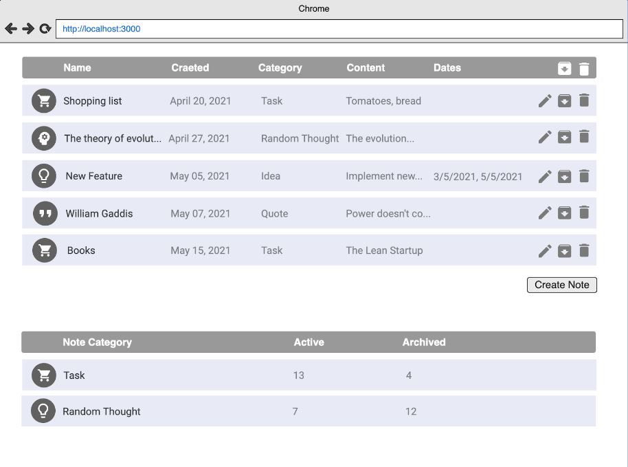

# Notes app test 1

# Test conditions

1. Your task is to create a notes app in JS as a web app. Users can add, edit and remove notes.
2. List of notes is displayed in a form of table (HTML representation may vary: table, divs etc). The columns are name, time of creation, note content, note category, etc. Categories are predefined: “Task”, “Random Thought”, “Idea”.
3. Notes in the table should also display a list of dates mentioned in this note as a separate column. For example, for a note “I’m gonna have a dentist appointment on the 3/5/2021, I moved it from 5/5/2021” the dates column is “3/5/2021, 5/5/2021”.
4. Users can archive notes. Archived notes are not shown in the notes list. Users can view archived notes and unarchive them.
5. There should also be a summary table which counts notes by categories: separately for active and archived. The table is updated whenever users perform some action on notes. The summary table is shown on the same page as the notes table.
   There is no need to implement data storage.
6. Simply create a JS variable which stores the data and prepopulate it with 7 notes so that they are shown when the page is reloaded.

7. Aim to write clean code.
   Write small functions, pure functions.
   Adhere to the single responsibility principle. Separate the logic of rendering and data processing, ideally to separate files.
   Give variables and functions descriptive names.

The goal of the task is to let you get better acquainted with the JavaScript language and browser DOM API. If you don’t know some of the APIs needed for the task, you might use these resources as references:
https://exploringjs.com/impatient-js https://developer.mozilla.org/ru/docs/Web/API/Document

While working on your task you should utilize all of the following:
JavaScript
Import / export
Array methods: map, reduce, filter (some of them)
Array spread operator
Regular expressions
Try / catch
DOM API
document.querySelector
document.addEventListener

Another skill you should practice is working with Git and Github. Implement the following git requirements while working on the task:
Make at least 3 commits
Push commits to the develop branch to your Github repository
When finished, create a pull request to the master branch
Try several git commands
See commit log
See diff between commits
Make some code changes and see git status
Perform reset --hard
https://git-scm.com/docs
https://guides.github.com/introduction/flow/

